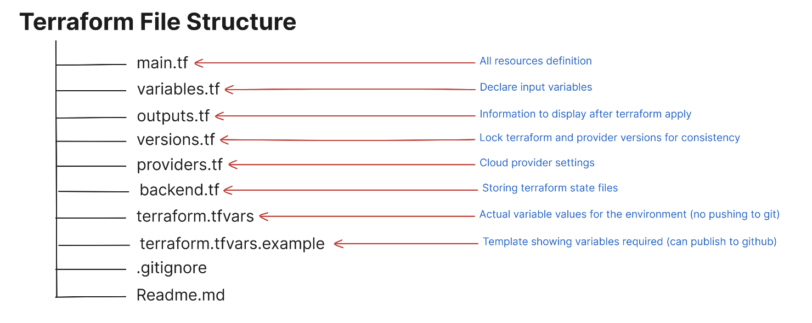

# Terraform File Structure

## File Breakdown

## 

## Example Filewise Configuration

### `main.tf`

```hcl
# Generate random string for unique bucket name
resource "random_string" "bucket_suffix" {
  length  = 8
  special = false
  upper   = false
}

# S3 Bucket resource
resource "aws_s3_bucket" "test_backend" {
  bucket = local.s3_bucket_name

  tags = {
    Name        = "Test Backend Bucket"
    Environment = var.environment
  }
}

# VPC resource
resource "aws_vpc" "main_vpc" {
  cidr_block = var.vpc_cidr_block

  tags = {
    Name        = local.vpc_name
    Environment = var.environment
  }
}

# EC2 instance resource
resource "aws_instance" "test_instance" {
  ami           = "ami-0c55b159cbfafe1f0"
  instance_type = var.ec2_instance_type
  subnet_id     = aws_subnet.main_subnet.id

  tags = {
    Name        = local.ec2_instance_name
    Environment = var.environment
  }
}

# Subnet resource (for EC2 instance)
resource "aws_subnet" "main_subnet" {
  vpc_id                  = aws_vpc.main_vpc.id
  cidr_block              = "10.0.1.0/24"
  availability_zone       = "us-east-1"
  map_public_ip_on_launch = true

  tags = {
    Name        = "Main Subnet"
    Environment = var.environment
  }
}
```

---

### `variables.tf`

```hcl
variable "bucket_name" {
  description = "Name of the S3 bucket"
  default     = "test-remote-backend"
}

variable "vpc_cidr_block" {
  description = "CIDR block for the VPC"
  default     = "10.0.0.0/16"
}

variable "ec2_instance_type" {
  description = "EC2 instance type"
  default     = "t2.micro"
}

variable "environment" {
  description = "The environment tag for resources (e.g., dev, staging, prod)"
  default     = "dev"
}
```

---

### `locals.tf`

```hcl
locals {
  s3_bucket_name   = "${var.bucket_name}-${random_string.bucket_suffix.result}"
  vpc_name         = "main-vpc-${var.environment}"
  ec2_instance_name = "test-instance-${var.environment}"
}
```

---

### `outputs.tf`

```hcl
output "s3_bucket_name" {
  description = "The name of the S3 bucket"
  value       = aws_s3_bucket.test_backend.bucket
}

output "vpc_id" {
  description = "The ID of the created VPC"
  value       = aws_vpc.main_vpc.id
}

output "ec2_instance_public_ip" {
  description = "The public IP of the EC2 instance"
  value       = aws_instance.test_instance.public_ip
}
```

---

### `providers.tf`

```hcl
# Configure the AWS Provider
terraform {
  required_providers {
    aws = {
      source = "hashicorp/aws"
      version = "~> 6.0"
    }
  }
}
provider "aws" {
  # Configuration options
  region = "us-east-1"
}
```

---

### `backend.tf`

```hcl
terraform {
  backend "s3" {
    bucket         = "awsbucket.yashchavan"
    key            = "dev/terraform.tfstate"
    region         = "us-east-1"
    encrypt        = true
    use_lockfile   = "true"
  }
}
```

---

### `.gitignore` (Basic Configuration)

```
.terraform*
*.tfstate
*.tfstate.*
.terraform.lock.hcl
crash.log
*.log
terraform.tfvars
*.tfvars.json
.terraform/
```

---

## Complex Production-Grade Structure Example

### Way 1: Modular Approach

```plaintext
terraform-project/
├── modules/ # Reusable modules
│   ├── networking/
│   │   ├── main.tf
│   │   ├── variables.tf
│   │   ├── outputs.tf
│   │   └── README.md
│   ├── compute/
│   │   ├── main.tf
│   │   ├── variables.tf
│   │   ├── outputs.tf
│   │   └── README.md
│   └── database/
│       ├── main.tf
│       ├── variables.tf
│       ├── outputs.tf
│       └── README.md
```

---

### Way 2: Environment-Specific Configurations

```plaintext
terraform-project/
├── environments/ # Environment-specific configurations
│   ├── dev/
│   │   ├── main.tf
│   │   ├── variables.tf
│   │   ├── outputs.tf
│   │   ├── backend.tf
│   │   └── terraform.tfvars
│   ├── staging/
│   │   ├── main.tf
│   │   ├── variables.tf
│   │   ├── outputs.tf
│   │   ├── backend.tf
│   │   └── terraform.tfvars
│   └── prod/
│       ├── main.tf
│       ├── variables.tf
│       ├── outputs.tf
│       ├── backend.tf
│       └── terraform.tfvars
├── versions.tf   # Global version constraints
├── providers.tf  # Global provider configurations
└── README.md
```
