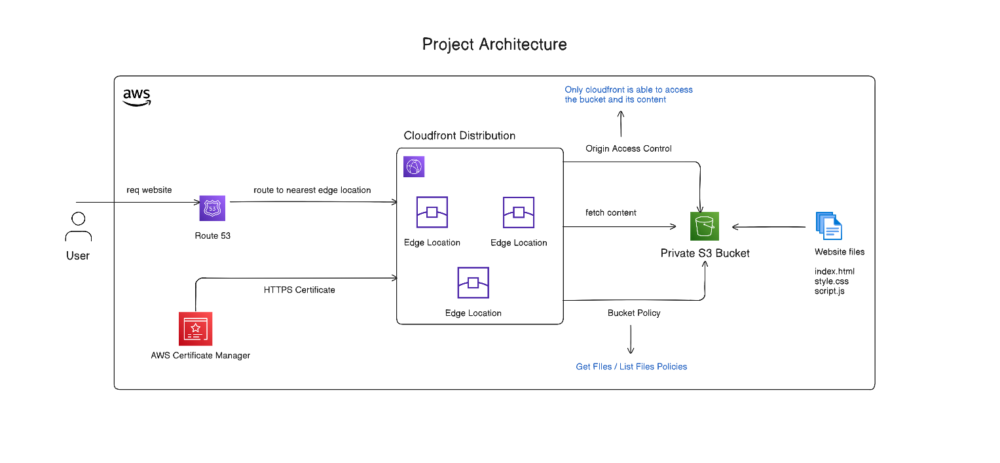

# Day 14: Static Website Hosting with S3 + CloudFront + Route53 (Full Stack)

> **What we built:** A complete static website hosting infrastructure on AWS using S3 as storage, CloudFront as CDN, and optionally Route53 for custom domains with ACM SSL certificates.

---

## Architecture Overview



- **S3 Bucket** - Stores the static files (HTML, CSS, JS)
- **CloudFront** - Global CDN that caches & serves content fast
- **OAC (Origin Access Control)** - Secures S3 bucket access
- **Route53** - Maps custom domain to CloudFront
- **ACM** - Provides SSL/TLS certificate for HTTPS

---

## Variables (`variables.tf`)

```hcl
variable "bucket_name" {
  default = "yashchavanweb12123"
}

variable "domain_name" {
  description = "The domain name for the website (e.g., example.com)"
  type        = string
  default     = ""
}

variable "route53_zone_id" {
  description = "The Route 53 hosted zone ID for the domain"
  type        = string
  default     = ""
}

variable "create_route53_record" {
  description = "Whether to create Route 53 record (set to false if you don't have a domain)"
  type        = bool
  default     = false
}
```

### Why These Variables?

| Variable                | What It Does                                     |
| ----------------------- | ------------------------------------------------ |
| `bucket_name`           | S3 bucket name - must be globally unique         |
| `domain_name`           | Your custom domain (e.g., `yashchavanweb.com`)   |
| `route53_zone_id`       | The hosted zone ID from Route53 console          |
| `create_route53_record` | Toggle to enable/disable Route53 + ACM resources |

> **Note:** The `create_route53_record` flag helps avoid creating Route53/ACM resources if you just want CloudFront default URL.

---

## Locals (`local.tf`)

```hcl
locals {
  origin_id = "S3-${aws_s3_bucket.my-website.id}"
}
```

- `origin_id` → A unique identifier for CloudFront to know which origin (S3) to fetch content from
- Uses interpolation: `"S3-${aws_s3_bucket.my-website.id}"`

---

## Main Infrastructure (`main.tf`)

### Create S3 Bucket

```hcl
resource "aws_s3_bucket" "my-website" {
  bucket = var.bucket_name
}
```

- Creates a new S3 bucket
- `bucket` → Name from variable (must be globally unique across all AWS accounts)

---

### Block Public Access (Security!)

```hcl
resource "aws_s3_bucket_public_access_block" "block" {
  bucket = aws_s3_bucket.my-website.id   # implicit dependency

  block_public_acls       = true
  block_public_policy     = true
  ignore_public_acls      = true
  restrict_public_buckets = true
}
```

| Field                     | What It Does                                       |
| ------------------------- | -------------------------------------------------- |
| `block_public_acls`       | Blocks new public ACLs from being set              |
| `block_public_policy`     | Blocks new public bucket policies                  |
| `ignore_public_acls`      | Ignores existing public ACLs                       |
| `restrict_public_buckets` | Restricts access to bucket if it has public policy |

> **Note:** We block ALL public access. Only CloudFront can access via OAC.

---

### Origin Access Control (OAC)

```hcl
resource "aws_cloudfront_origin_access_control" "oac" {
  name                              = "demo-oac-${var.bucket_name}"
  description                       = "OAC for static website"
  origin_access_control_origin_type = "s3"
  signing_behavior                  = "always"
  signing_protocol                  = "sigv4"
}
```

#### What is OAC?

- **Replaces the older OAI (Origin Access Identity)**
- Creates a secure connection between CloudFront and S3
- CloudFront signs all requests to S3 using SigV4

| Field                               | Meaning                                         |
| ----------------------------------- | ----------------------------------------------- |
| `origin_access_control_origin_type` | Type of origin (`s3`, `mediastore`, etc.)       |
| `signing_behavior`                  | `always` = sign every request to origin         |
| `signing_protocol`                  | `sigv4` = AWS Signature Version 4 (most secure) |

---

### Bucket Policy (Allow CloudFront)

```hcl
resource "aws_s3_bucket_policy" "allow_cloudfront" {
  bucket = aws_s3_bucket.my-website.id

  # Explicit dependency (using resource name, not attribute)
  depends_on = [aws_s3_bucket_public_access_block.block]

  policy = jsonencode({
    "Version": "2012-10-17",
    "Statement": [
      {
        "Sid": "AllowCloudFrontServicePrincipal",
        "Effect": "Allow",
        "Principal": {
          "Service": "cloudfront.amazonaws.com"
        },
        "Action": ["s3:GetObject"],
        "Resource": "${aws_s3_bucket.my-website.arn}/*",
        "Condition": {
          "StringEquals": {
            "AWS:SourceArn": "${aws_cloudfront_distribution.s3_distribution.arn}"
          }
        }
      }
    ]
  })
}
```

#### Understanding the Policy:

- **Principal** → Who can access? Only `cloudfront.amazonaws.com` service
- **Action** → What can they do? Only `s3:GetObject` (read files)
- **Resource** → What files? Everything inside the bucket (`/*`)
- **Condition** → Extra check: Only this specific CloudFront distribution

#### Dependency Types:

| Type         | How                           | When to Use                                |
| ------------ | ----------------------------- | ------------------------------------------ |
| **Implicit** | `aws_s3_bucket.my-website.id` | Terraform figures it out automatically     |
| **Explicit** | `depends_on = [resource]`     | When Terraform can't detect the dependency |

> Here we use `depends_on` because we need the public access block to be applied BEFORE the bucket policy.

---

### Upload Files Using `for_each` + `fileset`

```hcl
resource "aws_s3_object" "object" {
  for_each = fileset("${path.module}/www", "**/*")
  bucket   = aws_s3_bucket.my-website.id
  key      = each.value
  source   = "${path.module}/www/${each.value}"

  etag = filemd5("${path.module}/www/${each.value}")

  content_type = lookup({
    "html" = "text/html"
    "css"  = "text/css"
    "js"   = "application/javascript"
    "jpeg" = "image/jpeg"
    "png"  = "image/png"
    # ... more mappings
  }, regex("\\.[^.]+$", each.value) != null ? replace(regex("\\.[^.]+$", each.value), ".", "") : "txt", "application/octet-stream")
}
```

#### Breaking It Down:

| Part                          | What It Does                                              |
| ----------------------------- | --------------------------------------------------------- |
| `for_each = fileset(...)`     | Loops through all files in `www/` folder                  |
| `path.module`                 | Current module's directory path                           |
| `"**/*"`                      | Glob pattern: all files in all subdirectories             |
| `each.value`                  | Current file path in the loop                             |
| `etag = filemd5(...)`         | Hash to detect file changes (forces re-upload if changed) |
| `lookup({...}, key, default)` | Map lookup with fallback                                  |
| `regex("\\.[^.]+$", ...)`     | Extracts file extension (e.g., `.html`)                   |

> **Why `content_type`?** Without proper MIME type, browser won't render CSS/JS correctly!

---

### ACM Certificate for HTTPS

```hcl
resource "aws_acm_certificate" "cert" {
  count             = var.create_route53_record && var.domain_name != "" ? 1 : 0
  provider          = aws.us-east-1
  domain_name       = var.domain_name
  validation_method = "DNS"

  subject_alternative_names = ["www.${var.domain_name}"]

  lifecycle {
    create_before_destroy = true
  }
}
```

#### Key Points:

- `count = condition ? 1 : 0` → Conditional resource creation
- `provider = aws.us-east-1` → CloudFront requires certs in us-east-1
- `validation_method = "DNS"` → Validates ownership via DNS record
- `subject_alternative_names` → Also valid for `www.domain.com`
- `create_before_destroy` → Create new cert before destroying old (zero downtime)

---

### DNS Validation for ACM

```hcl
resource "aws_route53_record" "cert_validation" {
  for_each = var.create_route53_record && var.domain_name != "" ? {
    for dvo in aws_acm_certificate.cert[0].domain_validation_options : dvo.domain_name => {
      name   = dvo.resource_record_name
      record = dvo.resource_record_value
      type   = dvo.resource_record_type
    }
  } : {}

  allow_overwrite = true
  name            = each.value.name
  records         = [each.value.record]
  ttl             = 60
  type            = each.value.type
  zone_id         = var.route53_zone_id
}
```

#### What's Happening?

1. AWS gives you DNS validation records after creating cert
2. You add those records to Route53
3. AWS checks → validates you own the domain
4. Certificate becomes valid!

The `for_each` creates a record for each domain (main + www)

---

### Certificate Validation Complete

```hcl
resource "aws_acm_certificate_validation" "cert" {
  count                   = var.create_route53_record && var.domain_name != "" ? 1 : 0
  provider                = aws.us-east-1
  certificate_arn         = aws_acm_certificate.cert[0].arn
  validation_record_fqdns = [for record in aws_route53_record.cert_validation : record.fqdn]
}
```

- This resource **waits** until certificate is validated
- `validation_record_fqdns` → List of all DNS records that validate the cert

---

### CloudFront Distribution

```hcl
resource "aws_cloudfront_distribution" "s3_distribution" {
  origin {
    domain_name              = aws_s3_bucket.my-website.bucket_regional_domain_name
    origin_access_control_id = aws_cloudfront_origin_access_control.oac.id
    origin_id                = local.origin_id
  }

  enabled             = true
  is_ipv6_enabled     = true
  default_root_object = "index.html"
  aliases             = var.create_route53_record && var.domain_name != "" ? [var.domain_name, "www.${var.domain_name}"] : []

  default_cache_behavior {
    allowed_methods  = ["GET", "HEAD", "OPTIONS"]
    cached_methods   = ["GET", "HEAD"]
    target_origin_id = local.origin_id

    forwarded_values {
      query_string = false
      cookies {
        forward = "none"
      }
    }
    viewer_protocol_policy = "redirect-to-https"
    min_ttl                = 0
    default_ttl            = 3600
    max_ttl                = 86400
    compress               = true
  }

  price_class = "PriceClass_100"

  restrictions {
    geo_restriction {
      restriction_type = "none"
    }
  }

  viewer_certificate {
    cloudfront_default_certificate = var.create_route53_record && var.domain_name != "" ? false : true
    acm_certificate_arn            = var.create_route53_record && var.domain_name != "" ? aws_acm_certificate.cert[0].arn : null
    ssl_support_method             = var.create_route53_record && var.domain_name != "" ? "sni-only" : null
    minimum_protocol_version       = var.create_route53_record && var.domain_name != "" ? "TLSv1.2_2021" : null
  }

  depends_on = [aws_acm_certificate_validation.cert]
}
```

#### Key Fields Explained:

| Field                      | Purpose                                             |
| -------------------------- | --------------------------------------------------- |
| `origin.domain_name`       | S3 bucket's regional endpoint                       |
| `origin_access_control_id` | Links to our OAC for secure access                  |
| `default_root_object`      | What file to serve for `/` path                     |
| `aliases`                  | Custom domain names that point to this distribution |
| `allowed_methods`          | HTTP methods allowed (GET, HEAD for static site)    |
| `cached_methods`           | Methods whose responses get cached                  |
| `viewer_protocol_policy`   | `redirect-to-https` forces HTTPS                    |
| `min_ttl`                  | Minimum cache time (0 = can be invalidated)         |
| `default_ttl`              | Default cache time (3600s = 1 hour)                 |
| `max_ttl`                  | Maximum cache time (86400s = 24 hours)              |
| `compress`                 | Enable gzip/brotli compression                      |

#### Price Classes:

| Class            | Edge Locations              | Cost           |
| ---------------- | --------------------------- | -------------- |
| `PriceClass_100` | US, Canada, Europe          | Cheapest       |
| `PriceClass_200` | + Asia, Africa, Middle East | Medium         |
| `PriceClass_All` | All edge locations          | Most expensive |

#### SSL Settings:

- `sni-only` → Server Name Indication (modern, cheaper)
- `TLSv1.2_2021` → Minimum TLS version for security

---

### 4.10 Route53 A Records

```hcl
# Main domain
resource "aws_route53_record" "website" {
  count   = var.create_route53_record && var.domain_name != "" ? 1 : 0
  zone_id = var.route53_zone_id
  name    = var.domain_name
  type    = "A"

  alias {
    name                   = aws_cloudfront_distribution.s3_distribution.domain_name
    zone_id                = aws_cloudfront_distribution.s3_distribution.hosted_zone_id
    evaluate_target_health = false
  }
}

# WWW subdomain
resource "aws_route53_record" "website_www" {
  count   = var.create_route53_record && var.domain_name != "" ? 1 : 0
  zone_id = var.route53_zone_id
  name    = "www.${var.domain_name}"
  type    = "A"

  alias {
    name                   = aws_cloudfront_distribution.s3_distribution.domain_name
    zone_id                = aws_cloudfront_distribution.s3_distribution.hosted_zone_id
    evaluate_target_health = false
  }
}
```

#### Why Alias Records?

- Regular A records point to IP addresses
- **Alias records** point to AWS resources (CloudFront, ELB, S3)
- They're free (no extra charges for DNS queries)
- They automatically update if CloudFront IP changes

---

## Key Terraform Concepts Used

### Conditional Resource Creation

```hcl
count = condition ? 1 : 0
```

- If condition is true → create 1 resource
- If false → create 0 (skip entirely)
- Access with index: `resource_name[0].attribute`

### For Each with Objects

```hcl
for_each = {
  for item in list : key => value
}
```

- Creates multiple resources from a list/map
- Access with `each.key` and `each.value`

### Implicit vs Explicit Dependencies

```hcl
# Implicit - Terraform detects automatically
bucket = aws_s3_bucket.my-website.id

# Explicit - You tell Terraform
depends_on = [aws_s3_bucket_public_access_block.block]
```

### Lifecycle Rules

```hcl
lifecycle {
  create_before_destroy = true
}
```

- Controls how resources are created/destroyed
- `create_before_destroy` → Zero downtime updates

---
