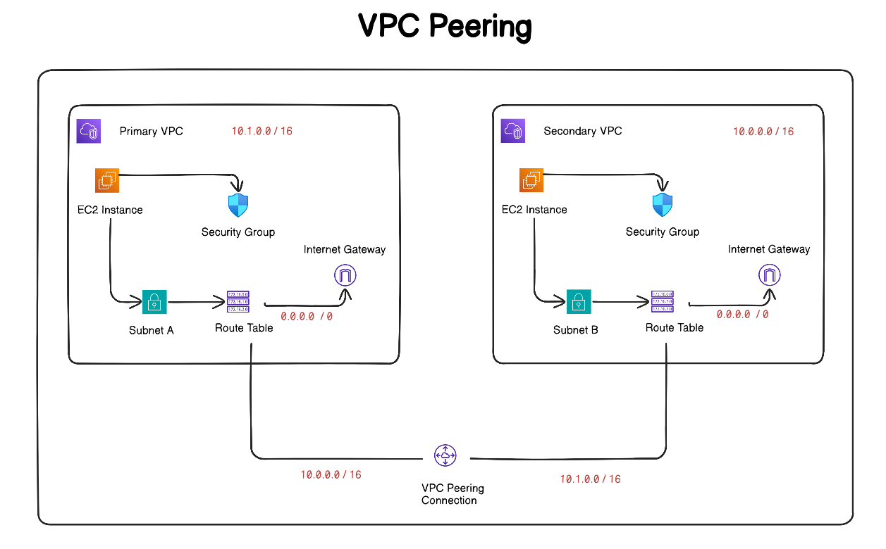

## Mini Project 2

### Task

- Create 2 VPCs in two different regions - us-east-1 and us-west-2
- Each of them will have a different IP range from each other
- Each of them will have EC2 instances with Apache configured
- Security groups to SSH into the instances
- Subnets in their respective VPCs
- Route tables and Internet Gateways
- VPC peering connection from A <-> B



## Next steps:

- Update the route tables to connect the VPCs privately
- Harden the security by allowing secure SSH access

## Transitive Peering

- Transitive peering does not work
- If VPC A is connected to B and B is connected to C, then A and C are not automatically connected - we have to create a direct peering between them

## Steps:

0. **Navigate to Working Directory**

- `cd` into your project directory so that all the PEM files will be created there

1. **Configure AWS CLI**

```bash
aws configure
```

- Enter all the necessary details (Access Key, Secret Key, Region, Output format)

2. **Create SSH Keys for Both Regions**

For creating the first key:

```bash
# Create key pair in us-east-1
aws ec2 create-key-pair --key-name vpc-peering-demo-east --region us-east-1 --query 'KeyMaterial' --output text > vpc-peering-demo-east.pem
```

Then create the 2nd key pair:

```bash
# Create key pair in us-west-2
aws ec2 create-key-pair --key-name vpc-peering-demo-west --region us-west-2 --query 'KeyMaterial' --output text > vpc-peering-demo-west.pem
```

Now to check whether the keys are created, you can run the following commands:

For the us-east-1 region:

```bash
aws ec2 describe-key-pairs --region us-east-1 --query 'KeyPairs[*].KeyName'
```

For the us-west-2 region:

```bash
aws ec2 describe-key-pairs --region us-west-2 --query 'KeyPairs[*].KeyName'
```

3. **Set File Permissions**

```bash
chmod 400 *.pem
```

4. **Start Writing Terraform Code**

## Terraform Configuration Steps

1. **Create Two Providers** - one as primary and one as secondary in `providers.tf`

```hcl
# Provider for the primary region (us-east-1)
provider "aws" {
  region = var.primary_region
  alias  = "primary"
}

# Provider for the secondary region (us-west-2)
provider "aws" {
  region = var.secondary_region
  alias  = "secondary"
}

```

- Also define the variable names in the `variables.tf` file:

```hcl
variable "primary_region" {
  description = "Primary AWS region for the first VPC"
  type        = string
  default     = "us-east-1"
}

variable "secondary_region" {
  description = "Secondary AWS region for the second VPC"
  type        = string
  default     = "us-west-2"
}
```

Now create a VPC in `main.tf` for the us-east-1 region:

```hcl
# Primary VPC in us-east-1
resource "aws_vpc" "primary_vpc" {
  provider             = aws.primary  # its a provider so the prefix is aws.
  cidr_block           = var.primary_vpc_cidr

  # for the vpc peering to work we need to enable these two
  enable_dns_hostnames = true
  enable_dns_support   = true

  tags = {
    Name = "Primary-VPC-${var.primary_region}"
  }
}
```

Here we also need to define the CIDR block in the `variables.tf` file:

```hcl
variable "primary_vpc_cidr" {
  description = "CIDR block for the primary VPC"
  type        = string
  default     = "10.0.0.0/16"
}
```

Similarly, create a resource for us-west-2 with a few variable changes:

```hcl
provider             = aws.secondary  # its a provider so the prefix is aws.
cidr_block           = var.secondary
```

And also the secondary CIDR block should not overlap with the primary:

```hcl
variable "secondary_vpc_cidr" {
  description = "CIDR block for the secondary VPC"
  type        = string
  default     = "10.1.0.0/16"
}
```

- After creating the VPCs, the next task is to create subnets inside them:

```hcl
# Subnet in Primary VPC
resource "aws_subnet" "primary_subnet" {
  provider                = aws.primary
  vpc_id                  = aws_vpc.primary_vpc.id   ## here we can also use primary_vpc_cidr
  cidr_block              = var.primary_subnet_cidr ## here we can also use primary_vpc_cidr
  availability_zone       = data.aws_availability_zones.primary.names[0]
  map_public_ip_on_launch = true  # making the instances available publically

  tags = {
    Name = "Primary-Subnet-${var.primary_region}"
  }
}
```

For the availability zone, we have created a data source:

```hcl
# Data source to get available AZs in Primary region
data "aws_availability_zones" "primary" {
  provider = aws.primary
  state    = "available"
}
```

This allows us to automatically select the first available availability zone.
In the same way, we can create the secondary subnet and its availability zone data source.

- After creating the VPC and subnets, we need to create an Internet Gateway for connectivity.

> **Note:** This is not secure for connecting two VPCs over the internet, but later we will be connecting them via VPC peering.

- For the Internet Gateway, create the following resource:

```hcl
# Internet Gateway for Primary VPC
resource "aws_internet_gateway" "primary_igw" {
  provider = aws.primary
  vpc_id   = aws_vpc.primary_vpc.id # as we have to associate it with the vpc created so requires the ID

  tags = {
    Name = "Primary-IGW"
  }
}
```

In the same way, we can create one for the second VPC.
The reason for creating two different gateways is that we want to initially connect them over the internet.

- After creating the Internet Gateway, we need to create the route table.
- This route table will help in routing the traffic from the VPC to the Internet Gateway.

```hcl
# Route table for Primary VPC
resource "aws_route_table" "primary_rt" {
  provider = aws.primary
  vpc_id   = aws_vpc.primary_vpc.id

  route {
    cidr_block = "0.0.0.0/0"  # so this means public, but later we need to setup a peer to peer connection
    gateway_id = aws_internet_gateway.primary_igw.id
  }

  tags = {
    Name = "Primary-Route-Table"
  }
}
```

In the same way, we will create the route table for the secondary subnet.

- Now, we need to associate the route table with the subnet so that the subnet can use the route table.

For that, we create the AWS route table association resource:

```hcl
resource "aws_route_table_association" "primary_rta" {
  provider       = aws.primary

  # connecting the subnet and the route table id
  subnet_id      = aws_subnet.primary_subnet.id
  route_table_id = aws_route_table.primary_rt.id
}
```

In the same way, we have to create the route table association for the secondary as well.

> **Note:** After creating every resource, make sure to run `terraform plan` to check if there are any errors.

Now that we have created all the resources, it's time to add the peering connections from both sides.

## Peering

```hcl
# VPC Peering Connection (Requester side - Primary VPC)
resource "aws_vpc_peering_connection" "primary_to_secondary" {
  provider    = aws.primary
  vpc_id      = aws_vpc.primary_vpc.id # source vpc id
  peer_vpc_id = aws_vpc.secondary_vpc.id  # this is the destination VPC Id
  peer_region = var.secondary_region
  auto_accept = false

  tags = {
    Name        = "Primary-to-Secondary-Peering"
    Side        = "Requester"
  }
}
```

After this, we also need to make the secondary VPC the acceptor. For that, we create the acceptor resource:

```hcl
# VPC Peering Connection Accepter (Accepter side - Secondary VPC)
resource "aws_vpc_peering_connection_accepter" "secondary_accepter" {
  provider                  = aws.secondary
  vpc_peering_connection_id = aws_vpc_peering_connection.primary_to_secondary.id
  auto_accept               = true  # here we need to make it true, as we want to accept the connection

  tags = {
    Name = "Secondary-Peering-Accepter"
    Side = "Accepter"
  }
}
```

In the same way, create the acceptor for the secondary as well.
Keep in mind that we need to put the primary as the `peer_vpc_id` and region so that it becomes a two-way connection.
For one-way connections, it would not work.

Now, after setting up the connection, we also need to set the route so that the traffic can flow from one VPC to the other:

```hcl
# Add route to Secondary VPC in Primary route table
resource "aws_route" "primary_to_secondary" {
  provider                  = aws.primary
  route_table_id            = aws_route_table.primary_rt.id
  destination_cidr_block    = var.secondary_vpc_cidr
  vpc_peering_connection_id = aws_vpc_peering_connection.primary_to_secondary.id

  depends_on = [aws_vpc_peering_connection_accepter.secondary_accepter]
}
```

This simply means: to go from primary to secondary VPC, this is the route that you have to follow.
In the same way, we will create the route from secondary to primary.

## Instances

- Now we need to create the two EC2 instances in the VPCs.
- First, we need to create the security groups for each instance:

```hcl

# Security Group for Primary VPC EC2 instance
resource "aws_security_group" "primary_sg" {
  provider    = aws.primary
  name        = "primary-vpc-sg"
  description = "Security group for Primary VPC instance"
  vpc_id      = aws_vpc.primary_vpc.id

 # Incoming traffic rules
  ingress {
    description = "SSH from anywhere"
    from_port   = 22
    to_port     = 22
    protocol    = "tcp"
    cidr_blocks = ["0.0.0.0/0"]  # this is open due to the internet gateway, but later we will make it secure
  }

# Internet message control protocol - pinging rules - checking if host is reachable
  ingress {
    description = "ICMP from Secondary VPC"
    from_port   = -1
    to_port     = -1
    protocol    = "icmp"
    cidr_blocks = [var.secondary_vpc_cidr]
  }

# Allow all TCP traffic from Secondary VPC
  ingress {
    description = "All traffic from Secondary VPC"
    from_port   = 0
    to_port     = 65535
    protocol    = "tcp"
    cidr_blocks = [var.secondary_vpc_cidr]
  }

# Outgoing traffic rules
# This rule allows the instances in this security group to send traffic to any destination.
  egress {
    description = "Allow all outbound traffic"
    from_port   = 0
    to_port     = 0
    protocol    = "-1"
    cidr_blocks = ["0.0.0.0/0"]  # same for this, we would make it secure
  }

  tags = {
    Name        = "Primary-VPC-SG"
  }
}
```

In the same way, we create the security group for the secondary environment as well.

Now finally, create the EC2 instances:

```hcl
# EC2 Instance in Primary VPC
resource "aws_instance" "primary_instance" {
  provider               = aws.primary
  ami                    = data.aws_ami.primary_ami.id
  instance_type          = var.instance_type

  # network config of the one we have created
  subnet_id              = aws_subnet.primary_subnet.id
  vpc_security_group_ids = [aws_security_group.primary_sg.id]
  key_name               = var.primary_key_name

    # it will have the nginx configuration
    # User data script gets executed when the instance is created
  user_data = local.primary_user_data

  tags = {
    Name        = "Primary-VPC-Instance"
    Environment = "Demo"
    Region      = var.primary_region
  }

  depends_on = [aws_vpc_peering_connection_accepter.secondary_accepter]
}

```

For setting up the user data, the script is added in the locals:

```hcl
locals {
  # User data template for Primary instance
  primary_user_data = <<-EOF
    #!/bin/bash
    apt-get update -y
    apt-get install -y apache2
    systemctl start apache2
    systemctl enable apache2
    echo "<h1>Primary VPC Instance - ${var.primary_region}</h1>" > /var/www/html/index.html
    echo "<p>Private IP: $(hostname -I)</p>" >> /var/www/html/index.html
  EOF
}
```

Create the same for the secondary instance as well.

One important thing is that we need to add the primary and the secondary key names.

For security purposes, add them in the environment variables or the `terraform.tfvars` file:

```hcl
# Use different key names for clarity
primary_key_name   = "vpc-peering-east"
secondary_key_name = "vpc-peering-west"
```

> Note: These key names should be the same pem file names, which you created when you executed the ssh key commands

## Testing

Now finally, run the following command:

```bash
terraform apply --auto-approve
```

When all the resources are created, you can go to the AWS Console and connect to the instances using their Public IP.

- Connect to both instances using the Public IP
- Then you can ping each other or curl each other

For ping:

```bash
ping <public_ip>
```

For curl:

```bash
curl http://<public_ip>
```
