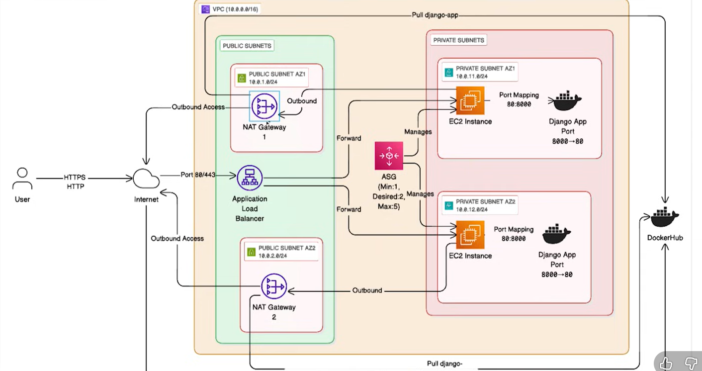

# Availability and Scalability using Terraform AWS with a Two-Tier Project

## Project Flow



1. User accesses the web application over the internet gateway via HTTP/HTTPS
2. The request goes to the Application Load Balancer

### Fault Tolerance

- The ALB has two target groups → Private Subnet A and Private Subnet B (both containing EC2 instances)
  > **Note:** The primary reason for dividing into two availability zones is that if one AZ goes down, requests will be served by the other

### Availability

- If the number of requests increases, an Auto Scaling Group handles the load
- The ASG configuration: min=1, desired=2, max=5
- When request volume increases, the ASG scales servers accordingly
- The application runs as a Docker container (not directly on EC2)
- Port mapping: 80:8000 (EC2:container)

### Accessing Private Subnets

- Servers in private subnets don't have direct outbound internet access
- A NAT Gateway service is required for outbound connectivity
- Place one NAT Gateway in each availability zone within the public subnet

**Example flow:**

- EC2 instance attempts to pull a Docker image
- Request goes to NAT Gateway
- NAT Gateway forwards to Internet Gateway
- Internet Gateway routes to the internet
- Image is pulled from DockerHub

---

## Project Implementation

### Application Load Balancer

- Load balancer type: application (vs. network LB or Classic LB)

```hcl
resource "aws_lb" "app_lb" {
  name               = "app-load-balancer"
  internal           = false
  load_balancer_type = "application"
  security_groups    = [aws_security_group.alb_sg.id]
  subnets            = aws_subnet.public[*].id

  enable_deletion_protection = false
  idle_timeout               = 60

  tags = {
    Name = "app-load-balancer"
  }
}
```

- A separate security group is created for ALB
- Ingress traffic allowed from ports 80 and 443
- Egress allowed from all ports (0)

#### Target Groups

- Redirects traffic from LB to EC2 instances
- Includes health checks so LB can verify server health
- Once it receives the threshold number of successful health checks, servers are added to the target group

```hcl
resource "aws_lb_target_group" "app_tg" {
  name     = "app-target-group"
  port     = 80
  protocol = "HTTP"
  vpc_id   = aws_vpc.main.id

  health_check {
    path                = "/"
    interval            = 30
    timeout             = 5
    healthy_threshold   = 2
    unhealthy_threshold = 2
  }

  tags = {
    Name = "app-target-group"
  }
}
```

#### Listeners

- Responsible for forwarding traffic from Load Balancer to target group
- Target groups perform health checks

```hcl
resource "aws_lb_listener" "http_listener" {
  load_balancer_arn = aws_lb.app_lb.arn
  port              = 80
  protocol          = "HTTP"

  default_action {
    type             = "forward"
    target_group_arn = aws_lb_target_group.app_tg.arn
  }
}
```

- If HTTPS traffic is enabled with SSL certificates, create a separate listener for HTTPS

### VPC

- Main VPC creation

```hcl
resource "aws_vpc" "main" {
  cidr_block           = var.vpc_cidr
  enable_dns_support   = true
  enable_dns_hostnames = true

  tags = {
    Name = "main-vpc"
  }
}
```

- DNS support and hostnames must be enabled for external accessibility

### Subnets

- Public subnets for ALB routing and NAT Gateway
- Private subnets for EC2 instances

```hcl
resource "aws_subnet" "public" {
  count                   = var.public_subnet_count  # Number of subnets to create
  vpc_id                  = aws_vpc.main.id
  cidr_block              = element(var.public_subnet_cidrs, count.index)
  availability_zone       = element(var.availability_zones, count.index)
  map_public_ip_on_launch = true

  tags = {
    Name = "public-subnet-${count.index + 1}"
  }
}
```

- The `element()` function returns a value from a list at the specified index
- `count.index` gets the index of the subnet

Same approach for private subnets. Resources with identical names are differentiated using tags:

```hcl
tags = {
  Name = "private-subnet-${count.index + 1}"
}
```

---

### Other Essential Components

Created so far:

- **VPC** → Unified store for the entire network
- **Subnets** → Groups to differentiate application and public layers

#### 1. Route Tables and Associations

```hcl
resource "aws_route_table" "public" {
  vpc_id = aws_vpc.main.id

  tags = {
    Name = "public-route-table"
  }
}
```

Routes are created for the internet gateway. Association links the route table to the public subnet:

```hcl
resource "aws_route_table_association" "public" {
  count          = var.public_subnet_count
  subnet_id      = aws_subnet.public[count.index].id
  route_table_id = aws_route_table.public.id
}
```

Similar configuration for private subnet route tables.

#### 2. Internet Gateway

```hcl
resource "aws_internet_gateway" "main" {
  vpc_id = aws_vpc.main.id

  tags = {
    Name = "main-internet-gateway"
  }
}
```

#### 3. Routes

- Define source and destination paths
- NAT Gateway ID is referenced here

```hcl
resource "aws_route" "private" {
  count                  = var.private_subnet_count
  route_table_id         = aws_route_table.private[count.index].id
  destination_cidr_block = "0.0.0.0/0"
  nat_gateway_id         = aws_nat_gateway.main[count.index].id
}
```

Subnet routes are associated with route tables.

#### 4. Public NAT Gateway

- Create one NAT Gateway per availability zone
- NAT Gateway requires an Elastic IP (static public IP that persists through instance restarts)

```hcl
# Create one Elastic IP per NAT Gateway
resource "aws_eip" "main" {
  count  = var.private_subnet_count
  domain = "vpc"

  tags = {
    Name = "nat-eip-az-${count.index + 1}"
  }

  depends_on = [aws_internet_gateway.main]
}
```

---

### EC2 Configuration

- Security group for EC2 only allows ingress traffic from ALB
- Ports 80 and 443 allowed from ALB security group
- Egress traffic allowed to anywhere

Example security group configuration:

```hcl
ingress {
  description     = "HTTP from ALB only"
  from_port       = 80
  to_port         = 80
  protocol        = "tcp"
  security_groups = [aws_security_group.alb_sg.id]
}
```

#### SSH Access to EC2

- Create a separate security group with only your IP address
- VPC ID matches EC2 instance VPC
- CIDR block set to your IP (temporarily 0.0.0.0/0 for testing)

---

### Auto Scaling Groups

- ASG uses a launch template to provision new servers
- Template defines how to run the application on new instances

```hcl
resource "aws_launch_template" "app" {
  name_prefix   = "app-launch-template-"
  image_id      = var.ami_id
  instance_type = var.instance_type

  vpc_security_group_ids = [
    aws_security_group.app_sg.id,
    aws_security_group.allow_ssh.id
  ]

  # File containing initialization instructions
  user_data = filebase64("${path.module}/scripts/user_data.sh")

  metadata_options {
    http_endpoint               = "enabled"
    http_tokens                 = "required"
    http_put_response_hop_limit = 1
  }

  monitoring {
    enabled = true
  }

  tag_specifications {
    resource_type = "instance"
    tags = {
      Name = "app-instance"
    }
  }
}
```

Auto Scaling Group definition:

```hcl
resource "aws_autoscaling_group" "app_asg" {
  name               = "app-asg"
  min_size           = var.min_size
  max_size           = var.max_size
  desired_capacity   = var.desired_capacity

  # Splat expression: private[*]
  vpc_zone_identifier = aws_subnet.private[*].id

  # Target group performs health checks
  target_group_arns         = [aws_lb_target_group.app_tg.arn]
  health_check_type         = "ELB"
  health_check_grace_period = 300

  launch_template {
    id      = aws_launch_template.app.id
    version = "$Latest"
  }

  tag {
    key                 = "Name"
    value               = "app-instance"
    propagate_at_launch = true
  }
}
```

#### Auto Scaling Policies

Define when to scale up or down:

1. **Scale in** - Adding additional servers
2. **Scale out** - Removing excess servers
3. **Scale up** - Improving server specifications
4. **Scale down** - Reducing server specifications

Example scaling policy:

```hcl
resource "aws_autoscaling_policy" "scale_out" {
  name                   = "scale-out"
  scaling_adjustment     = 1
  adjustment_type        = "ChangeInCapacity"
  cooldown               = 300
  autoscaling_group_name = aws_autoscaling_group.app_asg.name
}
```

Define metrics for scaling decisions:

```hcl
# Target Tracking Scaling Policy - CPU Utilization
resource "aws_autoscaling_policy" "target_tracking" {
  name                   = "target-tracking-policy"
  autoscaling_group_name = aws_autoscaling_group.app_asg.name
  policy_type            = "TargetTrackingScaling"

  target_tracking_configuration {
    predefined_metric_specification {
      predefined_metric_type = "ASGAverageCPUUtilization"
    }
    target_value = 70.0
  }
}
```

**Thresholds:**

- Above 70% CPU utilization → Add new server (scale in)
- Below 20% CPU utilization → Remove server (scale out)

CloudWatch alarms can also be configured for high CPU utilization monitoring.
